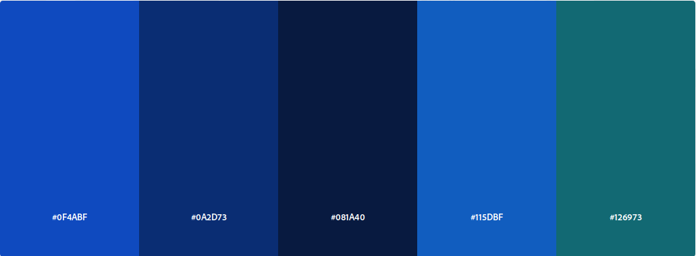
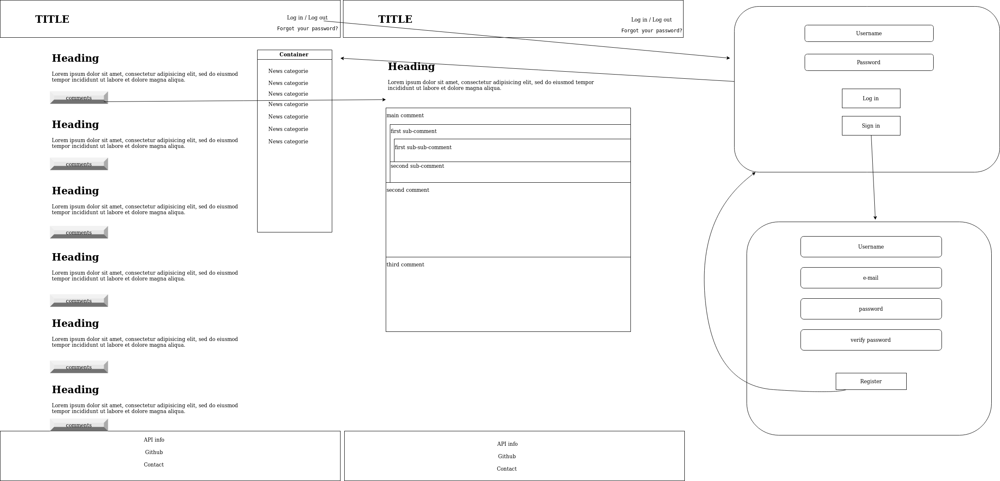

#                                             npProject

## Objectif

  In this project I have for objectif to create a functional news website with :

  - Backend
    - Node.js
  - Frontend
    - Javascript
    - html
    - css
  - API
    - [Google News API](https://gnews.io/)

## The color palette for this project

    

## Basic display I am heading form

    
