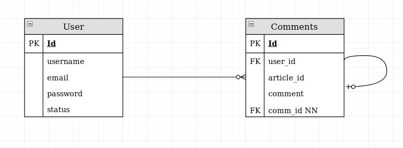

#                                             npProject

## Objectif

  In this project I have for objectif to create a functional news website with :

  - Backend
    - Node.js (Dependencies: express, ejs, mongoose, mongoose-unique-validator, body-parser, newsapi, dotenv, jsonwebtoken, nodemon, simplecrypt)
  - Frontend
    - Bootstrap
    - Javascript
    - html
    - css
  - API
    - [News API](https://newsapi.org/)

## The color palette for this project

  The color palette

## Basic display I am heading for

  The display

## What the database will look like

  The database

